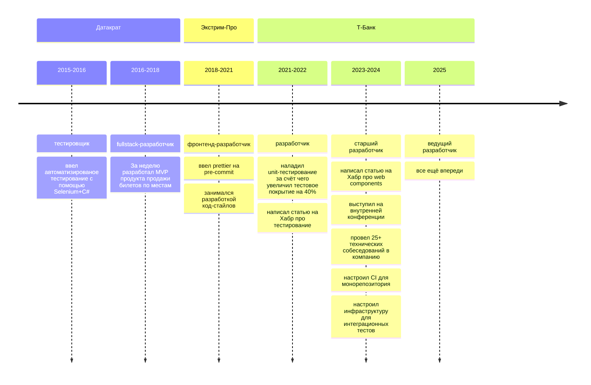
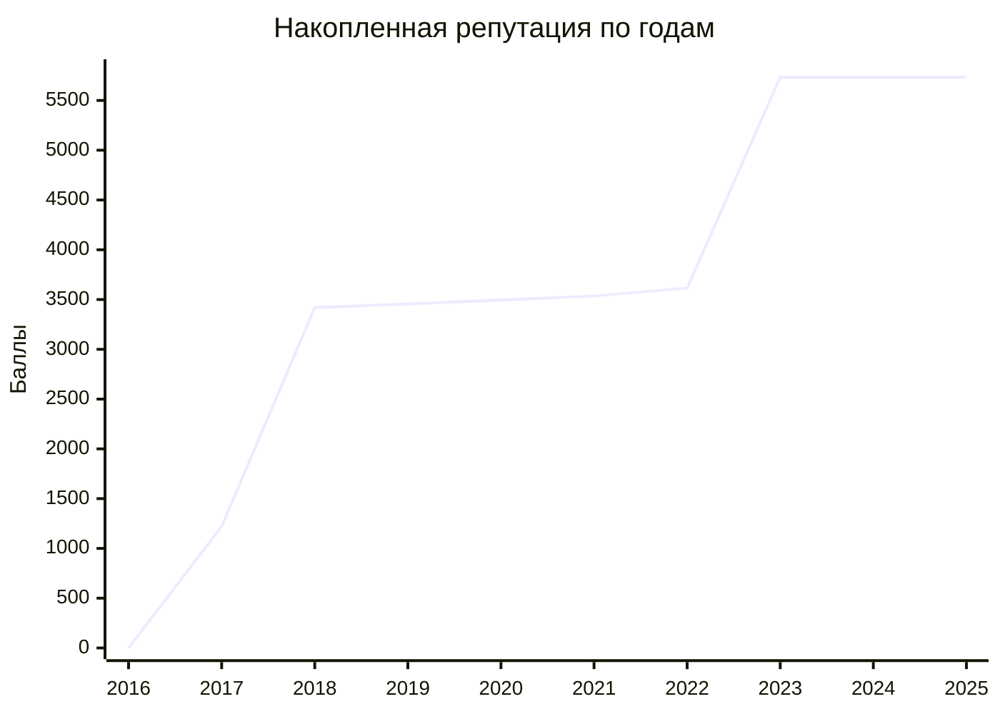
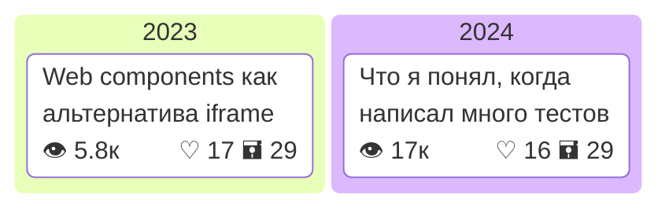

## Добро пожаловать в мой Github профиль!

Я Сергей, фронтенд-разработчик. Перекладываю json-ы, crash-у кнопки, пишу код и, возможно, умные мысли.

## Карьера

## stackoverflow 

добавить личную статистику, сколько ответов, какой в рейтинге и т.д.

## статьи

## Контакты

| Сайт | Ссылка |
| ------ | ----------- |
| Stackoverflow.ru   | [Ссылка](https://ru.stackoverflow.com/users/203140/sergey-glazirin) |
| Telegram | [Ссылка на канал](https://t.me/pet_project_sematary) |
| hh.ru    | [Резюме](https://ekaterinburg.hh.ru/applicant/resumes/view?resume=f4e218d4ff04058d390039ed1f6e4d386f4b53) |
