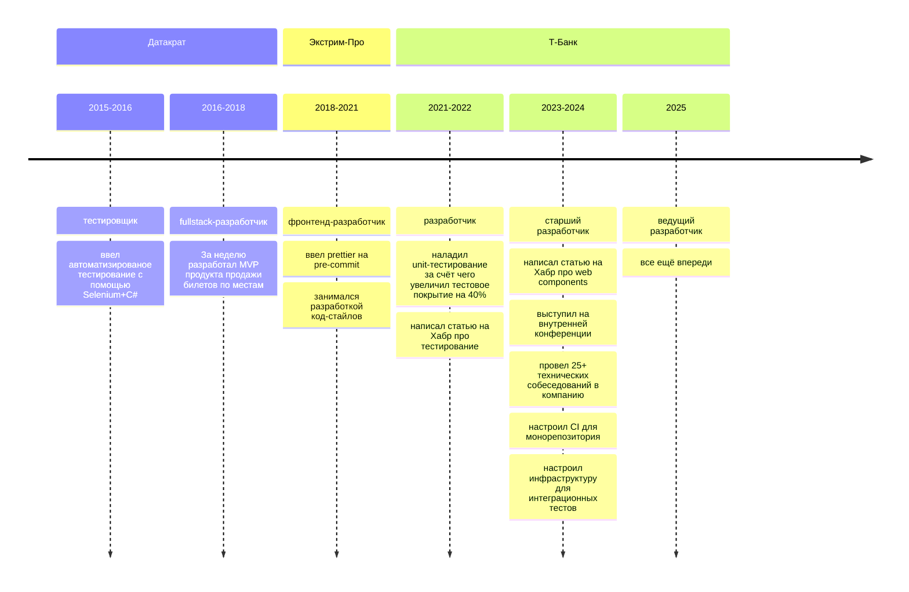
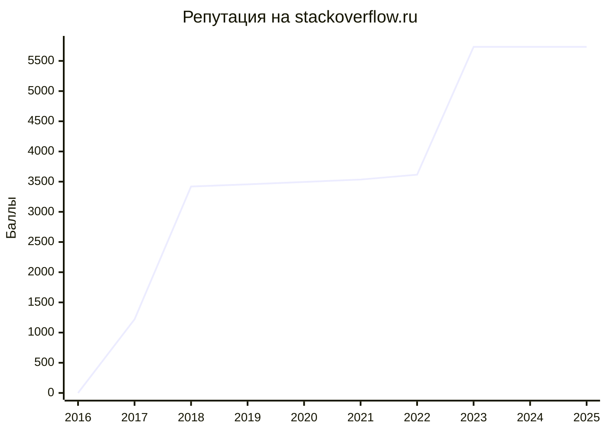
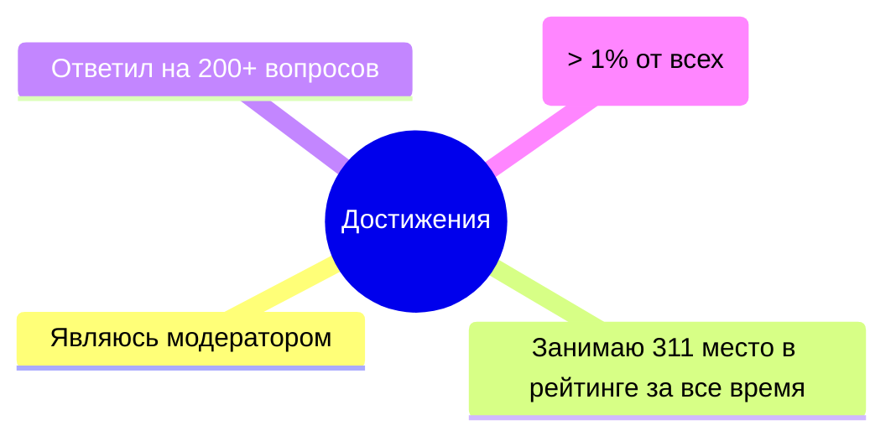
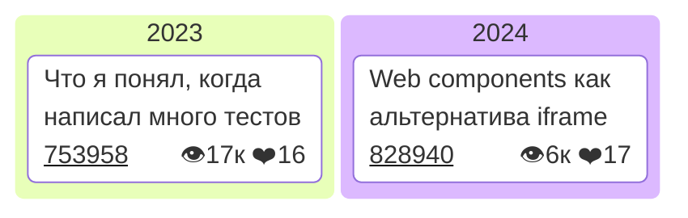

## Добро пожаловать в мой Github профиль!

Я Сергей, фронтенд-разработчик. Перекладываю json-ы, crash-у кнопки, пишу код и, возможно, умные мысли.

## Карьера

## Деятельность на Stackoverflow 

## Статьи

## Контакты

| Сайт | Ссылка |
| ------ | ----------- |
| Stackoverflow.ru   | [Профиль](https://ru.stackoverflow.com/users/203140/sergey-glazirin) |
| Telegram | [Канал](https://t.me/pet_project_sematary) |
