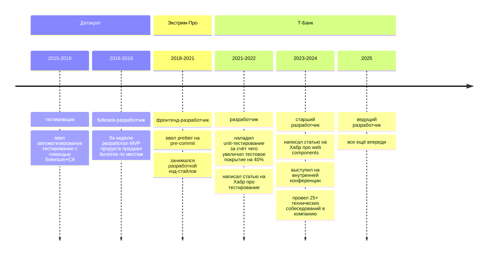
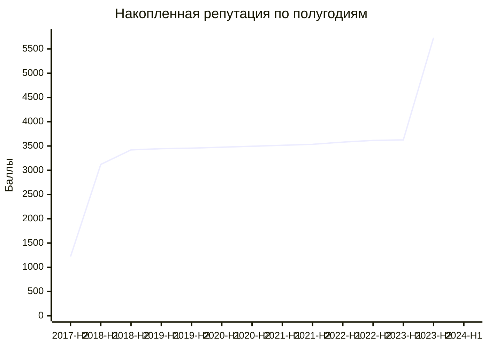
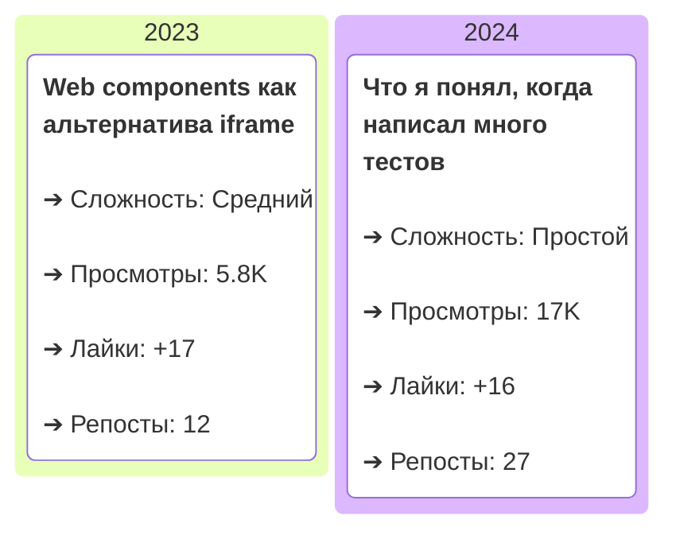

## Добро пожаловать в мой Github профиль!

Я Сергей, фронтенд-разработчик. Перекладываю json-ы, crash-у кнопки, пишу код и, возможно, умные мысли.




## stackoverflow 

добавить личную статистику, сколько ответов, какой в рейтинге и т.д.


## статьи




```mermaid
kanban
  title Канбан-доска статей
  column 2023
    card1["Web components как альтернатива iframe"]@{
      ticket: TASK-001,
      assigned: '+17 лайков', 
      priority: 'Medium'
    }
  column 2024
    card2["Что я понял, когда написал много тестов"]@{
      ticket: TASK-002,
      assigned: '+16 лайков',
      priority: 'Low'
    }
```


### Контакты

- Профиль на [Stackoverflow-ru](https://ru.stackoverflow.com/users/203140/sergey-glazirin)
- [Резюме на hh.ru](https://ekaterinburg.hh.ru/applicant/resumes/view?resume=f4e218d4ff04058d390039ed1f6e4d386f4b53)
- [Мой телеграмм-канал](https://t.me/pet_project_sematary)
